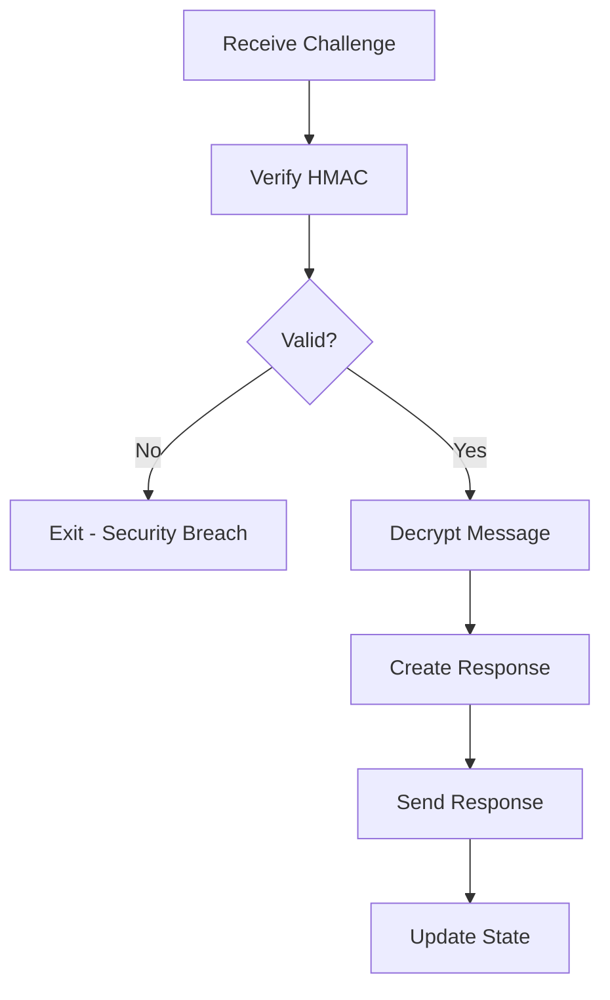

# Challenge-Response Protocol: Technical Analysis & Industry Applications

## 🔍 Protocol Logic & Design

### Core Concept
The Challenge-Response Protocol is a **mutual authentication mechanism** that ensures both parties (Alice and Bob) can verify each other's identity and the integrity of their communication without relying on a trusted third party.

### Why This Design Works

#### 1. **Symmetric Key Cryptography Foundation**
```
Shared Secret: Both parties know the same secret key (k)
```
- **Advantage**: Fast computation, no public key infrastructure needed
- **Security**: Key must be pre-shared securely
- **Use Case**: Perfect for closed systems, IoT devices, embedded systems

#### 2. **State-Based Security**
```
Counter (ctr): Prevents replay attacks
Nonce: Ensures message freshness
```
- **Counter Logic**: Each message uses a unique counter value
- **Nonce Logic**: Each message includes a unique nonce
- **Combined Effect**: Even if an attacker intercepts a message, they cannot replay it

#### 3. **Layered Security Architecture**

```
Layer 1: Confidentiality (XOR Encryption)
├── Message → Ciphertext using H(k||ctr)
└── Only parties with k and ctr can decrypt

Layer 2: Integrity (HMAC Authentication)  
├── Ciphertext + Nonce → HMAC signature
└── Any tampering is detected

Layer 3: Freshness (Nonce Verification)
├── Each message has unique nonce
└── Prevents replay of old messages
```

## 🛡️ Security Analysis

### Threat Model & Mitigations

| **Threat** | **How Protocol Mitigates** | **Implementation** |
|------------|----------------------------|-------------------|
| **Replay Attacks** | Counter prevents reuse of old messages | `c = m ⊕ H(k||ctr)` |
| **Message Tampering** | HMAC detects any modifications | `sig = HMAC_k(c||nonce)` |
| **Man-in-the-Middle** | Shared secret authentication | Both parties verify with same key |
| **Message Reordering** | Counter ensures sequential processing | Incrementing counter values |
| **Eavesdropping** | XOR encryption hides content | `m = c ⊕ H(k||ctr)` |

### Cryptographic Strength

#### **SHA-256 Hash Function**
- **Collision Resistance**: 2^128 operations to find collision
- **Pre-image Resistance**: 2^256 operations to reverse
- **Industry Standard**: Used in Bitcoin, TLS, and government systems

#### **HMAC-SHA256 Authentication**
- **Keyed Hash**: Requires secret key to generate valid MAC
- **Provably Secure**: Based on underlying hash function security
- **RFC 2104 Standard**: Widely adopted in industry

#### **XOR Encryption with Derived Keys**
- **Perfect Secrecy**: When key is truly random and used once
- **Key Derivation**: `H(k||ctr)` creates unique key per message
- **Efficiency**: Very fast computation

## 🏗️ Implementation Architecture

### Alice's Security Operations

```mermaid
graph TD
    A[Read Message] --> B[Create Key||Counter]
    B --> C[SHA-256 Hash]
    C --> D[XOR Encryption]
    D --> E[Create Ciphertext||Nonce]
    E --> F[HMAC-SHA256]
    F --> G[Send Challenge]
    G --> H[Wait for Response]
    H --> I[Verify Response]
    I --> J[Update State]
```

### Bob's Security Operations



### State Synchronization

```
Initial State: ctr=1, nonce=100
Alice: ctr=1, nonce=100 → ctr=2, nonce=101
Bob:   ctr=1, nonce=100 → ctr=2, nonce=101
```

**Critical**: Both parties must maintain identical state or protocol fails.

## 🌐 Real-World Industry Applications

### 1. **TLS/SSL Handshake (Simplified Version)**
```
Client Challenge → Server Response → Mutual Authentication
```
- **Similarity**: Both use challenge-response for authentication
- **Difference**: TLS uses asymmetric cryptography + certificates
- **Our Protocol**: Simpler, symmetric key-based

### 2. **WiFi WPA2/WPA3 Authentication**
```
Station → Access Point: Authentication Request
Access Point → Station: Challenge
Station → Access Point: Response (with shared secret)
```
- **Similarity**: Challenge-response with shared secrets
- **Difference**: Uses more complex key derivation
- **Our Protocol**: Educational foundation for understanding

### 3. **Banking ATM Authentication**
```
ATM → Bank: "I am ATM #12345"
Bank → ATM: Challenge (random number)
ATM → Bank: Response (encrypted with shared key)
```
- **Similarity**: Mutual authentication with shared secrets
- **Difference**: Uses hardware security modules
- **Our Protocol**: Demonstrates core concepts

### 4. **IoT Device Authentication**
```
Device → Gateway: "I am Device #ABC"
Gateway → Device: Challenge
Device → Gateway: Response (using pre-shared key)
```
- **Similarity**: Lightweight authentication for constrained devices
- **Difference**: Often uses elliptic curve cryptography
- **Our Protocol**: Perfect for learning IoT security basics

### 5. **API Authentication (HMAC-based)**
```
Client → Server: Request + HMAC signature
Server → Client: Response + HMAC signature
```
- **Similarity**: HMAC for message authentication
- **Difference**: Usually stateless (no counters)
- **Our Protocol**: Shows stateful version with replay protection

## 🔧 Practical Use Cases

### **When to Use This Protocol**

#### ✅ **Ideal Scenarios**
1. **Embedded Systems**: Microcontrollers with limited resources
2. **IoT Networks**: Device-to-device communication
3. **Closed Systems**: Internal corporate networks
4. **Educational Purposes**: Learning cryptographic protocols
5. **Legacy Systems**: Where public key infrastructure is not available

#### ❌ **Not Ideal For**
1. **Public Internet**: No key distribution mechanism
2. **Large Scale**: Key management becomes complex
3. **Multi-party**: Only works for two parties
4. **High Security**: Asymmetric crypto provides better security

### **Industry Standards Comparison**

| **Protocol** | **Key Type** | **Authentication** | **Replay Protection** | **Use Case** |
|--------------|--------------|-------------------|----------------------|--------------|
| **Our Protocol** | Symmetric | HMAC | Counter + Nonce | Learning, IoT |
| **TLS 1.3** | Asymmetric + Symmetric | Digital Certificates | Sequence Numbers | Web Security |
| **WPA3** | Symmetric + Asymmetric | SAE Handshake | Nonce | WiFi Security |
| **OAuth 2.0** | Tokens | JWT + HMAC | Timestamps | API Security |
| **Kerberos** | Symmetric | Ticket-based | Timestamps | Enterprise Auth |

## 🚀 Advanced Applications

### **1. Secure Firmware Updates**
```
Device → Server: "I need update, ctr=5"
Server → Device: Challenge + Encrypted Firmware
Device → Server: Response + Verification
```
- **Benefit**: Ensures firmware authenticity and prevents downgrade attacks
- **Implementation**: Our protocol + file encryption

### **2. Secure Configuration Management**
```
Device → Config Server: "Request config, nonce=123"
Config Server → Device: Encrypted Config + HMAC
Device → Config Server: Acknowledgment
```
- **Benefit**: Secure distribution of device configurations
- **Implementation**: Our protocol + configuration data

### **3. Secure Logging**
```
Device → Log Server: Encrypted Log Entry + HMAC
Log Server → Device: Acknowledgment
```
- **Benefit**: Tamper-proof audit trails
- **Implementation**: Our protocol + log data

## 🔬 Cryptographic Analysis

### **Security Properties**

#### **Confidentiality**
- **Method**: XOR with SHA-256 derived key
- **Strength**: Depends on key entropy and hash function
- **Vulnerability**: If counter is predictable, key becomes predictable

#### **Integrity**
- **Method**: HMAC-SHA256
- **Strength**: Cryptographically secure message authentication
- **Vulnerability**: None if HMAC implementation is correct

#### **Authenticity**
- **Method**: Shared secret key
- **Strength**: Depends on key secrecy
- **Vulnerability**: Key compromise breaks entire system

#### **Freshness**
- **Method**: Nonce + Counter
- **Strength**: Prevents replay attacks
- **Vulnerability**: Clock synchronization issues

### **Attack Vectors & Defenses**

| **Attack** | **How It Works** | **Our Defense** | **Effectiveness** |
|------------|------------------|-----------------|-------------------|
| **Replay Attack** | Re-send old messages | Counter prevents reuse | ✅ **High** |
| **Man-in-the-Middle** | Intercept and modify | HMAC detects changes | ✅ **High** |
| **Key Brute Force** | Try all possible keys | 256-bit key space | ✅ **Very High** |
| **Hash Collision** | Find two inputs with same hash | SHA-256 resistance | ✅ **Very High** |
| **Timing Attack** | Measure execution time | Constant-time operations | ⚠️ **Medium** |

## 📊 Performance Analysis

### **Computational Complexity**
- **SHA-256**: O(1) per message
- **HMAC**: O(1) per message  
- **XOR**: O(n) where n = message length
- **Overall**: O(n) linear complexity

### **Memory Requirements**
- **Message**: 32 bytes (fixed)
- **Keys**: 32 bytes (SHA-256 output)
- **State**: 8 bytes (2 integers)
- **Total**: ~72 bytes per session

### **Network Overhead**
- **Ciphertext**: 32 bytes
- **Signature**: 32 bytes
- **Total**: 64 bytes per message
- **Efficiency**: 200% overhead (32 bytes → 64 bytes)

## 🎯 Learning Outcomes

### **What This Protocol Teaches**

1. **Cryptographic Primitives**: SHA-256, HMAC, XOR encryption
2. **State Management**: Counters and nonces for security
3. **Protocol Design**: Step-by-step security verification
4. **Implementation**: Real-world coding with OpenSSL
5. **Security Analysis**: Understanding attack vectors and defenses

### **Industry Relevance**

This protocol serves as a **foundation** for understanding:
- **TLS Handshakes**: More complex but similar principles
- **WiFi Authentication**: WPA2/WPA3 use similar concepts
- **API Security**: HMAC-based authentication
- **IoT Security**: Lightweight authentication protocols
- **Blockchain**: Merkle trees and hash-based security

## 🔮 Future Enhancements

### **Potential Improvements**

1. **Asymmetric Keys**: Add public key cryptography for key exchange
2. **Perfect Forward Secrecy**: Generate new keys for each session
3. **Multi-party Support**: Extend to group communication
4. **Quantum Resistance**: Use post-quantum cryptographic algorithms
5. **Hardware Security**: Integrate with TPM or secure elements

### **Production Considerations**

1. **Key Management**: Secure key distribution and rotation
2. **Error Handling**: Robust failure modes and recovery
3. **Logging**: Security event monitoring and alerting
4. **Performance**: Optimization for high-throughput scenarios
5. **Compliance**: Meet industry security standards

---

## 📚 Conclusion

The Challenge-Response Protocol we implemented demonstrates **fundamental security principles** used throughout the industry. While simplified, it provides a solid foundation for understanding:

- **How authentication works** in real systems
- **Why cryptographic primitives** are combined in specific ways
- **What makes protocols secure** against various attacks
- **How to implement security** in actual code

This knowledge directly applies to understanding and working with modern security protocols like TLS, WiFi security, API authentication, and IoT device security.

**The protocol is not just an academic exercise—it's a practical introduction to the security mechanisms that protect our digital world.**
